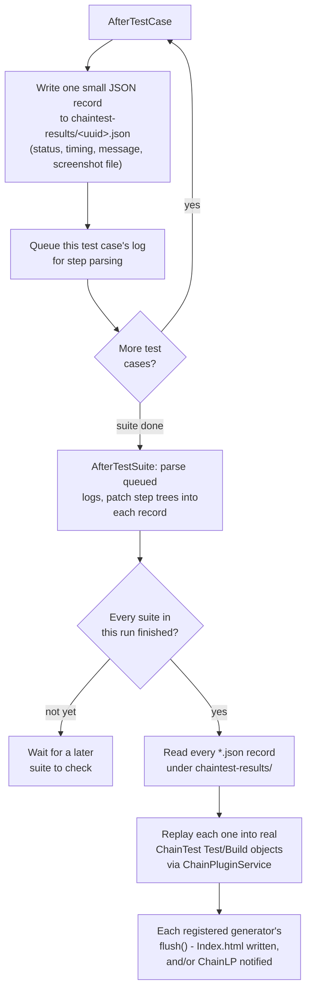

# Architecture

This document explains how the bridge is put together and why the harder
parts work the way they do. It assumes you've read the README's "Why this
exists" table - this goes one level deeper, into the actual mechanics.

## Integration point

Katalon Studio auto-discovers any class under `Test Listeners/` and invokes
methods annotated `@BeforeTestSuite` / `@BeforeTestCase` / `@AfterTestCase` /
`@AfterTestSuite` at the corresponding points in a run. That's the entire
integration surface - no plugin registration, no OSGi bundle, no build
step. `ChainTestListener.groovy` is deliberately thin: four methods, each
one line, delegating straight to `ChainTestReportBridge`. Katalon's
listener mechanism is the only part of this system Katalon actually has to
know about.

## What ChainTest actually is, under the hood

ChainTest ships official plugins for TestNG, JUnit5, and Cucumber-JVM, but
no framework-agnostic facade comparable to some other reporting libraries'
"create a report, create a test, log to it" API. What those three official
plugins are themselves built on - and what this bridge uses directly - is
one layer down, in `chaintest-core`:

- `com.aventstack.chaintest.domain.Test` - a plain, mutable POJO
  representing one node in the report (a suite, a test case, or a step),
  with real public setters for everything, including `startedAt`/
  `endedAt`. Nodes nest via `addChild()`.
- `com.aventstack.chaintest.domain.Build` - one POJO per run, holding
  aggregate stats, tags, and system info.
- `com.aventstack.chaintest.service.ChainPluginService` - the orchestration
  glue: owns the `Build`, tracks registered generators, and exposes
  `afterTest(Test, Optional<Throwable>)` to add a completed top-level
  `Test` to the run.
- `com.aventstack.chaintest.generator.Generator` - the interface each
  output type implements (`ChainTestSimpleGenerator` for the static HTML
  report, `ChainLPGenerator` for the optional real-time server).

This is a legitimate, intended extension point - confirmed by reading
`ChainTestListener` (the TestNG plugin's own class, unrelated to this
bridge's own class of the same simple name) and seeing it built the exact
same way: populate `Test`/`Build` objects from TestNG's own callbacks,
register generators, call `afterTest()`/`flush()`. This bridge is a fourth
integration built on the same primitives, for Katalon instead of TestNG/
JUnit5/Cucumber.

## Deferred report assembly

A Katalon Test Suite Collection can run its member suites in genuinely
separate OS processes, each with its own short-lived JVM - there is no
single long-running process that could hold one live `ChainPluginService`/
`Build`/`Test` object graph across a whole Collection run. So this bridge
never builds that object graph mid-run. Instead:

Every test case's outcome is durable on disk the moment it's known, and the
real ChainTest object graph is only ever built once per run, in whichever
suite's process is determined to be the last to finish - see "Deciding when
to generate the report" below. Two consequences worth being explicit about:

- **No in-memory state has to survive across Katalon's execution phases.**
  Each phase either writes a file or reads files written earlier - nothing
  needs a live object to persist between `BeforeTestSuite`, a `TestCase`,
  and `AfterTestSuite`, which matters because Katalon does not guarantee
  those phases share a call stack, a thread, or even a process.
- **Test Suite Collection support - including isolated-process member
  suites - falls out of this "for free".** Every process just writes its
  own JSON records to the same shared results directory on the filesystem,
  and whichever process's `AfterTestSuite` is determined to run last reads
  the whole directory and builds the report.

A single test case's own `BeforeTestCase` → body → `AfterTestCase` span is
not reliably single-threaded, so a test case's start time (and its buffered
manual `ChainTestKeywords.step()` calls) are tracked in a plain static map
keyed by `testCaseId`, not a `ThreadLocal` set in `BeforeTestCase` and read
in `AfterTestCase`. Once step capture has run, the timing is overwritten
with the authoritative value read straight from Katalon's own execution log
(`ILogRecord.getStartTime()`/`getEndTime()` on the matched
`TestCaseLogRecord`), the same source Katalon's own reports use. The one
remaining `ThreadLocal` (`currentTestCaseId`) only has to survive from
`startTestCase()` to that test case's own script body calling a keyword -
one continuous, in-order call on a single thread.

## Verifying the jar set

`com.aventstack:chaintest-core:1.0.12`'s own POM declares, as hard
(non-optional) dependencies: Jackson (databind/core/annotations), SnakeYAML,
FreeMarker, SLF4J API, and - notably - the full AWS S3 SDK and Azure Blob
Storage SDK (`azure-storage-blob`, `azure-storage-common`, `azure-identity`,
`software.amazon.awssdk:s3`/`apache-client`). Resolving that POM's full
transitive dependency tree would drag megabytes of cloud-SDK jars onto a
Katalon project's classpath for a feature (optional cloud upload of
screenshots) this bridge never uses.

Verified rather than assumed, via a standalone smoke test outside Katalon
(construct `Test`/`Build` objects, register `ChainTestSimpleGenerator`,
produce a real `Index.html`) with only `chaintest-core`, FreeMarker,
Jackson, SnakeYAML, and SLF4J API on the classpath, deliberately excluding
the AWS/Azure jars: it runs correctly. `chaintest-core`'s own storage
integration (`StorageServiceFactory.getStorageService(...)`) is only ever
invoked if `chaintest.storage.service.enabled=true` is explicitly set, which
this bridge's shipped config never does - the AWS/Azure classes are
referenced in `chaintest-core.jar`'s bytecode but never loaded at runtime
unless that path is actually exercised. Lombok, also declared in the POM,
is `provided` scope - a compile-time annotation processor for
`chaintest-core`'s own build, not needed by consumers (also verified: the
smoke test compiles and runs with no Lombok jar present).

## A real bug in ChainTest 1.0.12, worked around

`ChainTestSimpleGenerator.flush()` builds its Freemarker template's data
model with `Map.of("documentTitle", ..., "js", _js, "css", _css, ...)`.
`Map.of(...)` throws `NullPointerException` on any `null` argument, and
`_js`/`_css` come straight from the config map with no fallback - if
`chaintest.generator.simple.js`/`.css` are simply absent from
configuration (the normal case; they're optional customization hooks),
report generation crashes every time. Reproduced with a standalone smoke
test before shipping this bridge. Worked around by always emitting both
keys as empty strings in the config map this bridge builds
(`ChainTestConfig.buildSimpleGeneratorConfig()`) - never omitted, even when
a user hasn't customized either.

## Self-contained (mostly) HTML

`chaintest.generator.simple.offline=true` copies the CSS/JS/font resources
`ChainTestSimpleGenerator` ships as classpath resources inside its own jar
into a sibling `resources/` folder next to `Index.html`, instead of loading
them from a CDN - this bridge always enables it. Verified directly by
inspecting a real generated report's HTML and file listing, not assumed
from the offline flag's name alone.

One thing offline mode does *not* eliminate, found the same way: the
template's `<head>` unconditionally includes a
`<link href="https://fonts.googleapis.com/...">` for its Roboto heading
font, regardless of the offline setting - there's no config flag for it.
This is a non-blocking reference (the page loads and renders fully without
network access; the heading font just falls back to the browser's default
sans-serif), not a hard dependency, but it means the report isn't fully
air-gapped the way its own "offline mode" name might suggest. Nothing this
bridge can override without patching ChainTest's own shipped template.

Content itself is rendered directly into the static HTML server-side -
Freemarker templates evaluate `${...}` expressions against the `Test`/
`Build` model at generation time, so the resulting `Index.html` is a
complete, final document. Screenshots are saved as separate PNG files
under `resources/` (via `Test.addEmbed(byte[], "image/png")`), not inlined
as base64 - a folder-plus-file report, same shape as the offline CSS/JS
resources, opened directly via `file://`.

## Deciding when to generate the report

A Test Suite Collection should produce exactly one combined report,
written once every member suite has finished - not regenerated after each
one. `shouldGenerateReportNow()` determines this by comparing the number of
sub-suites Katalon planned for the run (read once from `plan.jsonl`, when
present) against how many distinct suite instances have reported
themselves complete so far, tracked in `.chaintest-collection-progress.txt`.
Falls back to `true` - generate every time - whenever either signal can't
be determined, which can only cause extra, harmless regenerations, never a
skipped one that matters.

## Locking across processes, not just threads

`withRunLock()` combines a `synchronized` block (for same-JVM threads) with
a real `FileLock` on `.chaintest-run.lock` under the results directory
(for genuinely separate OS processes, which a Test Suite Collection's
`ISOLATED_PROCESS` suites can be). A `synchronized` block alone only
serializes threads inside one JVM; the file lock actually serializes access
across separate processes. The `synchronized` block still sits underneath
it because a second `FileLock` attempt from another thread in the *same*
JVM throws `OverlappingFileLockException` instead of blocking, so something
has to queue same-JVM threads before they reach the file lock at all. Every
read or write of the run marker, collection-progress, and pending-steps
files, plus the final read-every-record-and-generate step, happen inside
it.

## Step-level detail

Turning a test case's execution log into a nested ChainTest step tree
can't happen inside that test case's own `AfterTestCase`: Katalon keeps the
log file open until every `AfterTestCase` listener registered for that test
case, not just this one, has returned. Reading it too early risks a
mid-write parse failure.

Instead, `AfterTestCase` only records a pending entry (test case ID, its
result UUID, its log folder) to `.chaintest-pending-steps.txt`.
`AfterTestSuite` processes every currently-pending entry - not just the
finishing suite's own - since whichever suite's `AfterTestSuite` runs first
ends up doing the work for others too when suites run concurrently. Parsing
uses Katalon's own `TestSuiteXMLLogParser` rather than a hand-rolled XML
parser: Katalon's execution logs can contain raw control characters that a
strict parser rejects outright, and Katalon's own parser already strips
them before parsing. The parsed result is converted into a plain nested
`Map`/JSON step tree - this bridge's own format, not ChainTest's - which
gets replayed into real `Test.addChild()` calls only at final-generation
time, consistent with the deferred-build design above.

A suite whose log only closes once its own `AfterTestSuite` call returns
creates a narrower timing gap that a short retry loop covers for every
suite except the last one in a run - which has no later suite left to hand
an unparsed entry to. That case falls to a bounded synchronous retry (up
to 20 attempts, one second apart) inside the final suite's own call
instead, rather than a background thread: a CI pipeline that runs one
suite per `katalonc` invocation exits the process almost immediately after
the listener returns, which would kill a background thread before it
finished.

Manual `ChainTestKeywords.step()` calls are appended as their own log
entries alongside the auto-captured step tree, not positionally
interleaved into it - the deferred-build design has no live, in-order step
stack available during the test's own execution to interleave into (the
step tree is only assembled later, at final-generation time, from the JSON
record). Auto-capture (the zero-touch default) gets the full,
correctly-ordered step tree; opting into manual instrumentation adds
detail rather than replacing it.

## Ordering suites in the report

`generateReport()` sorts suite groups alphabetically by `bareSuiteName()`
(case-insensitive) before replaying them, with start time as the tiebreaker
- first between repeat occurrences of the same suite name, then between
test cases within one occurrence. Deliberately not attempted via the Test
Suite Collection's own configured row order (reading `plan.jsonl`): that
approach was tried for a related Katalon reporting bridge and found
silently unreliable across real console-mode runs, for reasons that
couldn't be fully pinned down even after two independent, individually
well-reasoned fix attempts - alphabetical order carries no run-state
dependency and was adopted here from the start rather than repeating that
investigation.

Unlike some other reporting libraries' own "Suites" view (backed by a
hash-ordered `Set` with no insertion-order guarantee, requiring a
client-side DOM reorder to fix), ChainTest's `Test.children` and
`ChainPluginService`'s internal test queue are both plain ordered
collections (`ConcurrentLinkedQueue`) - confirmed by reading
`chaintest-core`'s own source. Whatever order this bridge inserts `Test`
objects in is the order the static report actually renders them in, with
no further indirection to account for.

## Real timestamps vs. replay time

The deferred-build design means every test's real execution has already
finished, sometimes minutes earlier, by the time `replayTestCase()`
constructs a `Test` object for it. Unlike some reporting libraries' own
test objects, `com.aventstack.chaintest.domain.Test` has genuine public
`setStartedAt(long)`/`setEndedAt(Long)` setters - no `getModel()`-style dig
into a live object graph is needed. Verified directly, not just assumed
from the setters' existence: a controlled standalone test set a test
case's window to a deliberately implausible date (`1970-01-02`, chosen so
it couldn't be mistaken for a real "now") and confirmed the rendered report
showed exactly that date and the correct 5-second duration for that row.

**One aggregate value does *not* pick this up automatically.** `Build`'s
own `startedAt`/`endedAt` - rendered in the report's top summary bar - are
separate fields from any individual `Test`'s. `Build.startedAt` defaults to
construction time (i.e., replay time, when `ChainPluginService` is
constructed at the start of `generateReport()`), and
`ChainPluginService.flush()` unconditionally calls `Build.complete()`,
which re-stamps `Build.endedAt` to `System.currentTimeMillis()` with no
window left afterward to override it before a generator reads it. Found
and confirmed with the same kind of controlled test as above (a deliberate
past-dated window on the `Build`) before it was fixed, not assumed from
reading the source alone.

Fixed by not calling `ChainPluginService.flush()` at all. Instead, this
bridge computes the true `min(start)`/`max(stop)` across every test case
record (data already correct and available from the deferred-build JSON
records), sets it directly on `service.getBuild()`, and then calls each
active generator's own `flush(topLevelTests)` directly - bypassing
`ChainPluginService.flush()`'s internal `Build.complete()` call entirely.
`Build.result` is unaffected by skipping it: that's already correctly
priority-aggregated by `Build.updateStats()`, called internally by every
`ChainPluginService.afterTest()` invocation, independent of `complete()`.

The same class of issue applies one level up too: each suite-level `Test`
object's own duration/timestamp is rendered from *its own* `startedAt`/
`endedAt`, and `Test.complete()` bubbles up to its parent on every child
completion - recomputing the parent's aggregate result correctly, but also
re-stamping the parent's `endedAt` to the replay instant each time. Fixed
the same way: after every test case for a given suite occurrence has been
replayed, that suite's own `Test` object's window is set once more, from
the true `min(start)`/`max(stop)` across just its own children - the last
thing done to it before any generator reads it.

## Suite labels for repeated occurrences

When a Test Suite Collection runs the same underlying suite more than once
(e.g. the same suite listed twice with two different browsers), every
distinct occurrence Katalon actually ran stays its own separate group in
the report - two occurrences are never merged into one, whether they share
the same browser, a different browser, the same test cases, or a different
mix. `assignDisplayLabels()` groups by `suiteInstance`'s raw, per-occurrence
value - see `suiteInstanceKey()` below for how that value is derived - and
only cleans up the visible *label*: the occurrence's own browser replaces
Katalon's own opaque per-occurrence identifier where that's already enough
to tell two occurrences of the same suite apart (the common case), falling
back to a plain `#2`/`#3` ordinal - ordered by which occurrence actually
started first - only when even name+browser collide.

Grouping key is the raw `suiteInstance` value, not individual test-case
records: multiple test cases sharing one ordinary suite occurrence (e.g.
one "API Test Suite" occurrence running both an API-only test case with no
browser and a WebUI one with a browser) resolve to the same label, never
split across two different groups just because one of the test cases
doesn't use a browser. Browser also becomes one of the test case's own
`Test.addTag(...)` values - visible and filterable in the report's own tag
chips - independent of the suite label. Whether an occurrence's label gets
a browser suffix at all is based on whether *any* test case in that
occurrence used one, not just whichever test case happened to start first.
The label uses only the suite's own leaf name (`bareSuiteName()`), not the
full Test Suites folder path `suiteInstance` otherwise carries (e.g.
"FolderSuite", not "TestSuitesFolder/FolderSuite") - the folder-qualified
value is still what's used internally to key grouping, so a same-named
suite nested in a different folder is never merged with it; only the
display text is shortened.

### suiteInstanceKey() and per-occurrence identity

`suiteInstanceKey()` derives a suite occurrence's identity from its own
report folder path, relative to the run's root, and keeps the trailing
per-suite-run timestamp segment as part of that identity, rather than
stopping short of it.

That matters because Katalon does not reliably add a disambiguating suffix
to the report folder *name* for a repeated suite in console-mode execution
- two occurrences of the same suite can both write to
`.../<suite name>/<own timestamp>`, an identical folder name, distinct only
by the timestamp subfolder. This is a Katalon behavior, not specific to any
one reporting library - confirmed independently by two other,
differently-built Katalon reporting bridges hitting the same fact on real
console-mode runs, one of them on real Linux CI logs specifically after an
earlier, narrower assumption (a hash suffix always present on the folder
*name*) passed local testing but broke silently in CI. Keeping the
timestamp segment, rather than assuming a folder-name suffix always
exists, is what actually tells two such occurrences apart;
`bareSuiteName()` strips it back out again for display, stripping the
timestamp segment before the hash-suffix pattern (for runs where Katalon
does add a folder-name suffix) rather than after - a timestamp like
`20260818_080402` is also a valid hex string, so running the hash-suffix
strip first would eat the last six digits of the timestamp and leave the
date attached to the wrong side of a slash.

## Failure tags

`failure-tags.json` defines named tags - `name`, `matchedStatuses`,
`messageRegex` - matched against each test's status and failure message at
final-generation time in plain Groovy, tuned for Katalon/Selenium exception
classification (Object Repository issues, timeouts, assertion failures,
environment/infrastructure issues, script/data issues). Applied through
ChainTest's own tag system (`Test.addTag(...)`), visible as filterable tag
chips in the report alongside a test's browser tag. A test can match more
than one definition.

## Status mapping

ChainTest's `Result` enum has five levels -
`UNKNOWN`/`PASSED`/`UNDEFINED`/`SKIPPED`/`FAILED` - with no separate
"broken" tier for a test that errored rather than failed an assertion.
Katalon's own `ERROR` and `INCOMPLETE` statuses both map to `FAILED` here
(via `Test.complete(Throwable)`, which sets `FAILED` unconditionally); the
original Katalon status string is always included in the logged detail
text so it isn't lost, just not visually distinguished from an assertion
failure. `SKIPPED` is set explicitly after `complete()`, since
`Test.complete()`'s own two-argument form only ever produces `PASSED` or
`FAILED`.

## ChainLP: opt-in real-time analytics

`ChainLPGenerator`, also part of `chaintest-core`, is registered exactly
like `ChainTestSimpleGenerator` when `chaintest.generator.chainlp.enabled`
is true - both read from the same `Test`/`Build` object graph this bridge
builds, independently of each other. If ChainLP is unreachable,
`ChainLPGenerator.start()` catches its own connection failure internally
and simply never marks itself `started()`; this bridge checks that flag
before adding it to the list of generators actually invoked at flush time,
so a ChainLP outage never affects (or even delays) the static report.

One config-injection subtlety, found by reading `ChainLPGenerator`'s and
`ChainTestApiClient`'s source rather than assumed from `ChainTestSimpleGenerator`'s
behavior: `ChainTestSimpleGenerator.start()` reads everything it needs from
the `Map<String,String>` config handed to it, but `ChainLPGenerator.start()`
constructs its own internal `ChainTestApiClient()` (no-arg constructor),
which reloads configuration itself from classpath resource files,
environment variables, and `System.getProperties()` - completely
independent of the map passed to `start()`, except for the enabled/
persist-embeds flags it checks directly. Since this bridge deliberately
never relies on ChainTest's own classpath-resource-based configuration
loading (see "Configuration resolution" below), every resolved
`chaintest.generator.chainlp.*` value is also mirrored into
`System.setProperty(...)` before either generator starts - the one config
layer both paths actually honour.

`ChainLPGenerator`'s own `flush()` PUTs the whole `Build` object to the
server, so the same `Build.setStartedAt()`/`setEndedAt()` fix described
above benefits what ChainLP displays too, not just the static report.

Docker isn't bundled or launched by this bridge itself - `chainlp/` in this
repository is a separate, manually-run `docker compose up`, kept
deliberately outside the zero-touch install path so the static report's
"no server" guarantee never depends on it.

### ChainLP's own frontend gap, and why a proxy fixes it instead of a rename

ChainLP's build-detail page labels its 3 summary charts by looking up the
build's `testRunner` string in a hardcoded list containing only
`testng`/`junit`/`junit5`/`cucumber-jvm` - confirmed by reading ChainLP's
own frontend source, then confirmed empirically with a headless-browser
render of a real build page: with `testRunner` set to this bridge's own
honest `"katalon"`, the lookup misses and the *entire* summary section
(titles, charts, and the pass/fail/skip counts underneath) silently fails
to render, not just the title text - a single failed lookup partway
through Angular's change-detection pass for that view aborts the rest of
it.

`chainlp/docker-compose.yml` runs a small nginx reverse proxy
(`chainlp-proxy`) in front of the real ChainLP container instead of
publishing it directly. Its [`nginx.conf`](../chainlp/proxy/nginx.conf)
passes every request through unchanged except for one `sub_filter`
substitution on ChainLP's own compiled JS response, adding a `katalon`
entry to that same lookup object rather than misrepresenting the runner
as `"testng"` to make the boxes render. This was deliberately chosen over
patching/rebuilding ChainLP from source (its frontend build isn't wired
into its own Maven/Docker build at all, so reproducing it would mean
inventing an undocumented build pipeline) and over renaming the runner
(which would permanently mislabel every build's actual origin).

The substitution targets the object's literal text content, not a
specific bundle filename (those are content-hashed and change on every
ChainLP release) - if a future ChainLP version reformats this object, the
substitution just stops matching and the page reverts to today's default
(blank summary boxes), never to a broken or corrupted response. Verified
directly: a headless-browser render of the real build page through the
proxy shows correct titles ("Suite"/"Test Case"/"Step") and correct
pass/fail/skip counts in all three boxes, where the same render without
the proxy showed all three completely empty.

## Configuration resolution

`ChainTestConfig.groovy` reads `Include/config/chaintest/chaintest.properties`
directly via `RunConfiguration.getProjectDir()` and a plain `File` read -
not via `chaintest-core`'s own `Configuration`/`ConfigurationManager`
classes, which look up classpath resources via
`Thread.currentThread().getContextClassLoader().getResourceAsStream(...)`.
Whether a loose (non-jar) properties file placed under `Include/config/`
is actually visible that way depends on exactly what Katalon adds to the
Groovy classpath, which isn't documented and wasn't worth relying on -
reading the file directly via a known project-relative path sidesteps the
question entirely.

`CHAINTEST_*` environment variable overrides are this bridge's own
addition, not something ChainTest itself provides in a shell-usable form:
`chaintest-core`'s own env var mechanism (`Configuration.load()`) only
picks up variables whose name is the literal property key itself (e.g. a
variable literally named `chaintest.generator.chainlp.host.url`, dots
included) - most shells, including bash's `export`, cannot define a
variable name containing dots at all. This bridge instead computes, per
known key, the shell-friendly `CHAINTEST_...` name
(`key.toUpperCase().replaceAll(/[.-]/, '_')`, both dots and hyphens folded
- several of ChainTest's own key names use hyphens, e.g. `output-file`,
which no other property naming convention in this bridge's lineage needed
to account for) and checks that instead, falling back to the properties
file, then to a hardcoded default.

Resolved values are handed to each generator two ways, both needed for the
reasons above: as a `Map<String,String>` passed directly to
`Generator.start(...)` (what `ChainTestSimpleGenerator` actually reads),
and mirrored into `System.setProperty(...)` (what `ChainLPGenerator`'s
internal `ChainTestApiClient` actually reads).

## Failure isolation

One rule holds everywhere in `ChainTestReportBridge`: every public entry
point catches `Throwable` and only logs a warning. A bug in report
generation must never fail, skip, or change the outcome of the real test
it's reporting on.

## Installer

Installing is a plain file copy into `Keywords/`, `Test Listeners/`,
`Include/`, and `Drivers/` - folders Katalon already auto-compiles and
auto-discovers regardless of a project's `.classpath` state, so a copied
file behaves identically whether the project is opened in the IDE, run
from `katalonc` on the command line, or run in CI. Every file the
installer writes is recorded in
`<project>/.chaintest-bridge/manifest.txt`, so uninstall removes exactly
what was installed and nothing else - generated `chaintest-results/`/
`chaintest-report/` and a customized `chaintest.properties` are kept by
default.

## CI detection

Reads each platform's own standard environment variables directly
(`JENKINS_URL`, `TF_BUILD`, `GITHUB_ACTIONS`, `GITLAB_CI`) at
final-generation time - whichever one is set determines the executor name
and build link written into the report's System Info panel via
`ChainPluginService.addSystemInfo(...)`, with a local, non-CI run as the
fallback.

## Not implemented: cross-run history in the static report

`ChainTestSimpleGenerator` shows only the current run, same as most static
HTML reporters - no built-in cross-run trend graph. ChainTest's own answer
to this is ChainLP (see above), which persists every build to a real
database and can render history/trends server-side; this bridge treats
that as the intended path for anyone who wants history, rather than
building a from-scratch trend view into the static report itself.
